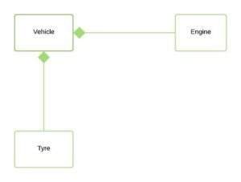

# Java SMI5  

## Join this link

[https://app.sli.do/event/ex3esarj]

---
Encapsulation in Python
    self.__data

---

## Class

---

    public class Dog {
        String breed;
        int age;
        String color;

        void barking() {
        }

        void hungry() {
        }

        void sleeping() {
        }
    }

---

## Variable types

---

* **Local variables**: Variables defined inside methods, constructors or blocks are called local variables. The variable will be declared and initialized within the method and the variable will be destroyed when the method has completed.

* **Instance variables**: Instance variables are variables within a class but outside its methods. These variables are initialized when the class is instantiated. Instance variables can be accessed from inside any method, constructor or blocks of that particular class.

* **Class variables**: Class variables are variables declared within a class, outside any method, with the static keyword.

---

## Constructors

---

        public class Puppy {
            public Puppy() {
            }

            public Puppy(String name) {
                // This constructor has one parameter, name.
            }
        }

---

## Creating an Object

---

* **Declaration**: A variable declaration with a variable name with an object type.

* **Instantiation**: The 'new' keyword is used to create the object.

* **Initialization** − The 'new' keyword is followed by a call to a constructor. This call initializes the new object.

---

    public class Puppy {
        public Puppy(String name) {
            // This constructor has one parameter, name.
            System.out.println("Passed Name is :" + name );
        }

    public static void main(String []args) {
            // Following statement would create an object myPuppy
            Puppy myPuppy = new Puppy( "tommy" );
        }
    }

---

## Accessing Instance Variables and Methods

---

    /* First create an object */
    ObjectReference = new Constructor();

    /* Now call a variable as follows */
    ObjectReference.variableName;

    /* Now you can call a class method as follows */
    ObjectReference.MethodName();

---

        public class Puppy {
            int puppyAge;

            public Puppy(String name) {
                // This constructor has one parameter, name.
                System.out.println("Name chosen is :" + name );
            }

            public void setAge( int age ) {
                puppyAge = age;
            }

            public int getAge( ) {
                System.out.println("Puppy's age is :" + puppyAge );
                return puppyAge;
            }

            public static void main(String []args) {
                /* Object creation */
                Puppy myPuppy = new Puppy( "tommy" );

                /* Call class method to set puppy's age */
            myPuppy.setAge( 2 );

                /* Call another class method to get puppy's age */
                myPuppy.getAge( );

                /* You can access instance variable as follows as well */
                System.out.println("Variable Value :" +     myPuppy.puppyAge );
            }
        }

---

## No argument Constructors

---

        Public class MyClass {
            Int num;
            MyClass() {
                num = 100;
            }
        }

---

## Parameterized Constructors

---

    // A simple constructor.
    class MyClass {
        int x;
    
        // Following is the constructor
        MyClass(int i ) {
            x = i;
        }
    }

---

## Primitive Data Types

---

    char c;
    boolean b; 
    double d; 
    float f; 
    long l; 
    int i;
    short sh; 
    byte by;

---

## Reference Datatypes

---

Classes

---

## Local Variables

---

    public class Test {
        public void pupAge() {
            int age = 0;
            age = age + 7;
            System.out.println("Puppy age is : " + age);
        }

        public static void main(String args[]) {
            Test test = new Test();
            test.pupAge();
        }
    }

---

## Instance Variables

---

    import java.io.*;
    public class Employee {

        // this instance variable is visible for any child class.
        public String name;

        // salary  variable is visible in Employee class only.
        private double salary;

        // The name variable is assigned in the constructor.
        public Employee (String empName) {
        name = empName;
        }

        // The salary variable is assigned a value.
        public void setSalary(double empSal) {
        salary = empSal;
        }

        // This method prints the employee details.
        public void printEmp() {
        System.out.println("name  : " + name );
        System.out.println("salary :" + salary);
        }

        public static void main(String args[]) {
        Employee empOne = new Employee("Ransika");
        empOne.setSalary(1000);
        empOne.printEmp();
        }
    }

---

## Class/Static Variables

---

    import java.io.*;
    public class Employee {

        // salary  variable is a private static variable
        private static double salary;

        // DEPARTMENT is a constant
        public static final String DEPARTMENT = "Development ";

        public static void main(String args[]) {
            salary = 1000;
            System.out.println(DEPARTMENT + "average salary:" + salary);
        }
}

---

## Access Control Modifiers

---

* Visible to the package, the default. No modifiers are needed.
* Visible to the class only (private).
* Visible to the world (public).
* Visible to the package and all subclasses (protected).

---

---

## Non-Access Modifiers

---

* The static modifier for creating class methods and variables.

* The final modifier for finalizing the implementations of classes, methods, and variables.

* The abstract modifier for creating abstract classes and methods.

* The synchronized and volatile modifiers, which are used for threads.

---

## Loop

---

    int [] numbers = {10, 20, 30, 40, 50};
    for(int x : numbers ) {
        System.out.print( x );
        System.out.print(",");
    }

---

    String [] names = {"James", "Larry", "Tom", "Lacy"};

    for( String name : names ) {
        System.out.print( name );
        System.out.print(",");
    }

---

## Conditional Statement

---

    if(condition1)
    {  
        //code for if condition1 is true  
    }
    else if(condition2)
    {  
        //code for if condition2 is true  
    }  
    else if(condition3)
    {  
        //code for if condition3 is true  
    }  
    else
    {  
        //code for all the false conditions   
    }    

---

    Exp1 ? Exp2 : Exp3;

---

## Methods

---

    return-type methodName(parameter-list){
        //body of method
    }

---

## Java is Strictly Pass by Value

---

## Iheritance: IS-A Relationship

---

    public class Animal{
    }
    public class Mammal extends Animal{
    }
    public class Reptile extends Animal{
    }

---

## Aggregation: HAS-A relationship

---

    public class Vehicle{}
    public class Speed{}
    public class Van extends Vehicle {
        // Van has Speed
        private Speed sp;
    }

---

---

## Polymorphism

---

### Overriding

---

    class Animal {
        public void move() {
            System.out.println("Animals can move");
            }
    }
    class Dog extends Animal {
        public void move() {
            System.out.println("Dogs can walk and run");
        }
        public void bark() {
            System.out.println("Dogs can bark");
        }
    }
    public class TestDog {
        public static void main(String args[]) {
            Animal a = new Animal();   // Animal reference and object
            Animal b = new Dog();   // Animal reference but Dog object
            a.move();   // runs the method in Animal class
            b.move();   // runs the method in Dog class
            b.bark();
        }
    }

---

### super keyword

---

    class Animal {
        public void move() {
            System.out.println("Animals can move");
        }
    }

    class Dog extends Animal {
        public void move() {
            super.move();   // invokes the super class method
            System.out.println("Dogs can walk and run");
        }
    }

    public class TestDog {
        public static void main(String args[]) {
            Animal b = new Dog();   // Animal reference but Dog object
            b.move();   // runs the method in Dog class
        }
    }

---

## Abstraction

---

    public abstract class Employee {
        private String name;
        private String address;
        private int number;
        
        public abstract double computePay();
        // Remainder of class definition
    }

---

    public class Salary extends Employee {
        private double salary;   // Annual salary
        
        public double computePay() {
            System.out.println("Computing salary pay for " + getName());
            return salary/52;
        }
        // Remainder of class definition
    }

---

Declaring a method as abstract has two consequences:

* The class containing it must be declared as abstract.

* Any class inheriting the current class must either override the abstract method or declare itself as abstract.

---

## Association

---

---

    import java.io.*; 
        
    // class bank 
    class Bank  
        { 
            private String name; 
            
            // bank name 
            Bank(String name) 
            { 
                this.name = name; 
            } 
            
            public String getBankName() 
            { 
                return this.name; 
            } 
        }  

---

    // employee class  
    class Employee { 
            private String name; 
            // employee name  
            Employee(String name)  
            { 
                this.name = name; 
            } 
            public String getEmployeeName() 
            { 
                return this.name; 
            }  
    }

---

    // Association between both the  
    // classes in main method 
    class Association{ 
        public static void main (String[] args){ 
                Bank bank = new Bank("Axis"); 
                Employee emp = new Employee("Neha"); 
                
                System.out.println(emp.getEmployeeName() +  
                    " is employee of " + bank.getBankName()); 
            } 
        } 

---

## Aggregation

---

---

    // Java program to illustrate 
    //the concept of Aggregation. 
    import java.io.*; 
    import java.util.*; 
    // student class 
    class Student{ 
            String name; 
            int id ; 
            String dept; 
            Student(String name, int id, String dept){ 
                this.name = name; 
                this.id = id; 
                this.dept = dept; 
            } 
        } 

---

        /* Department class contains list of student 
        Objects. It is associated with student 
        class through its Object(s). */
        class Department{ 
            String name; 
            private List<Student> students; 
            Department(String name, List<Student> students){ 
                this.name = name; 
                this.students = students; 
                
            } 
            public List<Student> getStudents(){ 
                return students; 
            } 
        } 
---
        /* Institute class contains list of Department 
        Objects. It is asoociated with Department 
        class through its Object(s).*/
        class Institute{ 
            String instituteName; 
            private List<Department> departments; 
            Institute(String instituteName List<Department> departments){ 
                this.instituteName = instituteName; 
                this.departments = departments; 
            }
---
            // count total students of all departments 
            // in a given institute  
            public int getTotalStudentsInInstitute(){ 
                int noOfStudents = 0; 
                List<Student> students;  
                for(Department dept : departments){ 
                    students = dept.getStudents(); 
                    for(Student s : students) { 
                        noOfStudents++; 
                    } 
                } 
                return noOfStudents; 
            } 
        }  
---

        // main method 
        class GFG 
        { 
            public static void main (String[] args){ 
                Student s1 = new Student("Mia", 1, "CSE"); 
                Student s2 = new Student("Priya", 2, "CSE"); 
                Student s3 = new Student("John", 1, "EE"); 
                Student s4 = new Student("Rahul", 2, "EE"); 
                // making a List of  
                // CSE Students. 
                List <Student> cse_students = new ArrayList<Student>(); 
                cse_students.add(s1); 
                cse_students.add(s2); 
                // making a List of  
                // EE Students 
                List <Student> ee_students = new ArrayList<Student>(); 
                ee_students.add(s3); 
                ee_students.add(s4);

---

                Department CSE = new Department("CSE", cse_students); 
                Department EE = new Department("EE", ee_students); 
                List <Department> departments = new ArrayList<Department>(); 
                departments.add(CSE); 
                departments.add(EE); 
                // creating an instance of Institute. 
                Institute institute = new Institute("BITS", departments); 
                System.out.print("Total students in institute: "); 
                System.out.print(institute.getTotalStudentsInInstitute()); 
            } 
        } 

---

## Composition

---

---

    // Java program to illustrate the 
    // difference between Aggregation 
    // Composition. 
  
    import java.io.*; 
  
    // Engine class which will  
    // be used by car. so 'Car' 
    // class will have a field  
    // of Engine type. 
    class Engine{
        // starting an engine.
        public void work(){ 
            System.out.println("Engine of car has been started ");
        }
    }

---

    // Engine class 
    final class Car  
    { 
        // For a car to move,  
        // it need to have a engine. 
        private final Engine engine; // Composition 
        //private Engine engine;     // Aggregation 
        
        Car(Engine engine) 
        { 
            this.engine = engine; 
        } 
        
        // car start moving by starting engine 
        public void move()  
        { 
            
            //if(engine != null) 
            { 
                engine.work(); 
                System.out.println("Car is moving "); 
            } 
        }
    }

---

    class GFG { 
        public static void main (String[] args)  
        { 
          
            // making an engine by creating  
            // an instance of Engine class. 
            Engine engine = new Engine(); 
            
            // Making a car with engine. 
            // so we are passing a engine  
            // instance as an argument while 
            // creating instace of Car. 
            Car car = new Car(engine); 
            car.move(); 
            
        } 
    }

---

#### **Aggregation vs Composition**

* Dependency: Aggregation implies a relationship where the child can exist independently of the parent. For example, Bank and Employee, delete the Bank and the Employee still exist. whereas Composition implies a relationship where the child cannot exist independent of the parent. Example: Human and heart, heart don’t exist separate to a Human
* Type of Relationship: Aggregation relation is “has-a” and composition is “part-of” relation.
* Type of association: Composition is a strong Association whereas Aggregation is a weak Association.

---

## References
[https://www.tutorialspoint.com/java/java_quick_guide.htm]
[https://www.studytonight.com/java/overview-of-java.php]
[BOOK: Head First Java, 2nd Edition]